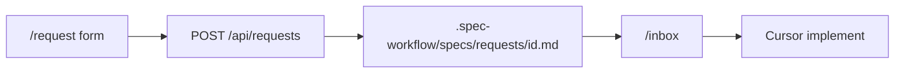

# AGENTS.md — Plain Jane's Task Ask

Agent-oriented source of truth for this repo. Human readers: see [README.md](README.md). Claude Code: see also [CLAUDE.md](CLAUDE.md).

## Screening summary

| Question | Answer |
|----------|--------|
| What is it? | Normalizes messy stakeholder text into minified PRD + ADR + Cursor prompt, saved as markdown, surfaced in dev inbox |
| Who benefits? | PMs/clients/founders (request) and developers using Cursor (inbox) |
| Core loop | `/request` → `POST /api/requests` → `.spec-workflow/specs/requests/<id>.md` → `/inbox` |
| Tests | `npm test` (Vitest: spec writer + API) |
| Stack | Node 20, Express, static `public/`, no database in v1 |

## Identity

- **Product:** Plain Jane's Task Ask
- **Tagline:** Plain English in. Builder-ready spec out.
- **Repo:** `calgary-cursor-2026-may` (GitHub name unchanged)
- **npm package:** `plain-janes-task-ask`

## Architecture



## UI design

Follow [`DESIGN.md`](DESIGN.md) (Clay via `npx getdesign@latest add clay`) for colors, type, and components. Cream canvas, Inter display headings, saturated step cards on `/request`, teal accents on `/inbox`.

## Key paths

| Path | Role |
|------|------|
| `DESIGN.md` | Clay design tokens and component rules |
| `server.js` | Express app, API, static files |
| `lib/normalize-request.js` | Rules (+ optional LLM when `useLlm`) → PRD, ADR, minified Cursor prompt |
| `lib/openrouter-client.js` | OpenRouter chat API (`openrouter/free` default) |
| `lib/spec-writer.js` | Assemble full markdown spec from normalized output |
| `lib/requests-store.js` | Read/write request specs; `requestNumber`; attachments |
| `lib/attachments.js` | Screenshot files + metadata |
| `lib/parse-create-payload.js` | JSON/multipart create payload |
| `lib/upload-middleware.js` | Multer (`screenshot` field) |
| `public/request/` | Stakeholder intake UI |
| `public/inbox/` | Developer Inbox (Open + Resolved cards) |
| `.spec-workflow/specs/requests/` | Generated specs (committed when demoing) |
| `scaffolds/cursor/` | ECC reinstall templates (not `.cursor/` itself) |
| `docs/ECC-SETUP.md` | Local ECC install steps |

## API routes

| Method | Path | Purpose |
|--------|------|---------|
| GET | `/api/config` | OpenRouter availability for UI toggle |
| POST | `/api/requests` | Create request (JSON or multipart + optional `screenshot`) |
| GET | `/api/requests` | List metadata incl. `requestNumber`, `summary`, `status` |
| GET | `/api/requests/:id` | Full spec + `cursorCopy` + `issueDraft` + `attachmentUrl` |
| GET | `/api/requests/:id/attachment` | Screenshot image when present |
| PATCH | `/api/requests/:id` | Update `status` only (`new` \| `in-cursor` \| `done`) |

## Spec file schema

YAML frontmatter (required):

```yaml
id: <uuid>
status: new | in-cursor | done
requesterLabel: string (name + role, required)
createdAt: ISO-8601
normalized: rules | llm+rules | rules (llm-unavailable)
llmModel: string  # when LLM polish ran
attachment: path  # when screenshot saved
```

Markdown headings (preserve when editing):

- `## Cursor prompt (minified)` — primary paste target for agents
- `## PRD (minified)` — goal, user, frequency, success, constraints (table)
- `## ADR` — Context, Decision, In scope, Out of scope, Open questions
- `## Raw intake (verbatim)` — original stakeholder text (audit only)
- `## Attachment (screenshot)` — when request included an image
- `## GitHub issue draft`

## Inbox UX

- Sidebar: **Open** card (status `new` or `in-cursor`) and **Resolved** card (status `done`)
- List items show stable `#1`, `#2`, … (oldest submit = `#1`)
- Detail pane: status banner, spec preview, **Copy for Cursor**, status dropdown

## Builder workflow

1. Stakeholder completes `/request`.
2. Open `/inbox`, select request, **Copy for Cursor**.
3. In Cursor: implement from `.spec-workflow/specs/requests/<id>.md`.
4. Optional: paste **GitHub issue draft** section into a new issue.
5. Set status `in-cursor` → `done`.

## Suggested agent prompt

```text
Implement the feature described in .spec-workflow/specs/requests/<id>.md.
Follow AGENTS.md conventions. Do not commit .cursor/ or secrets.
```

## Conventions

- ES modules (`"type": "module"` in package.json)
- Node 20+, Express 4, no database in v1
- Minimal dependencies; Vitest for `lib/` and API tests
- Do not add competitor names, hackathon strategy, or third-party workflow tool references to public docs

## Commands

```bash
npm install
npm test
npm start
```

Default URL: http://localhost:3000

## Definition of done (feature work)

- Core loop verified manually or via tests
- Spec schema headings unchanged unless product spec updated
- README API table matches `server.js`

## Out of scope for agents

- Committing `.cursor/` ECC install
- `docs/private/`
- Phase 4 GitHub Actions / Railway unless explicitly requested
